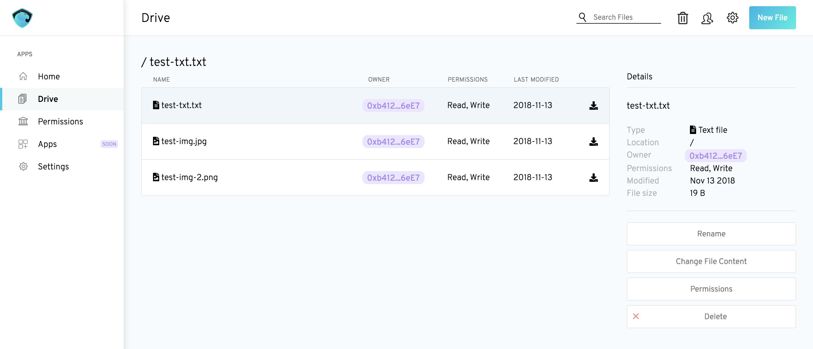

# Aragon Drive

Aragon Drive is an application that allows easy file storing and sharing within your Aragon decentralized autonomous organization (DAO). It is a decentralized alternative to apps like Google Drive and DropBox but really is different in the sense that it can be used as a file system for your DAO.



Files are compressed before storage and will be safely encrypted if they are not public. Other features include:
- Giving read/write permissions on files to various entities and groups of entities
- Managing your files with folder structures
- Identifying files with custom labels
- Communicating through comment threads on each file
- Choosing through various settings options regarding storage and encryption

Aragon Drive uses the [Aragon Datastore](https://github.com/espresso-org/aragon-datastore) library and [Aragon Comments](https://github.com/espresso-org/aragon-comments).

If you wish to contribute to this project, please check out the [contributing file](CONTRIBUTING.md).


## Install

First install the npm packages:

```bash
npm install
```

Then start the devchain:

```bash
npm run devchain
```

And publish the ObjectACL:

```bash
npm run publish:object-acl
```

You are now ready to start Drive :)

## Usage

```bash
npm run start
```
